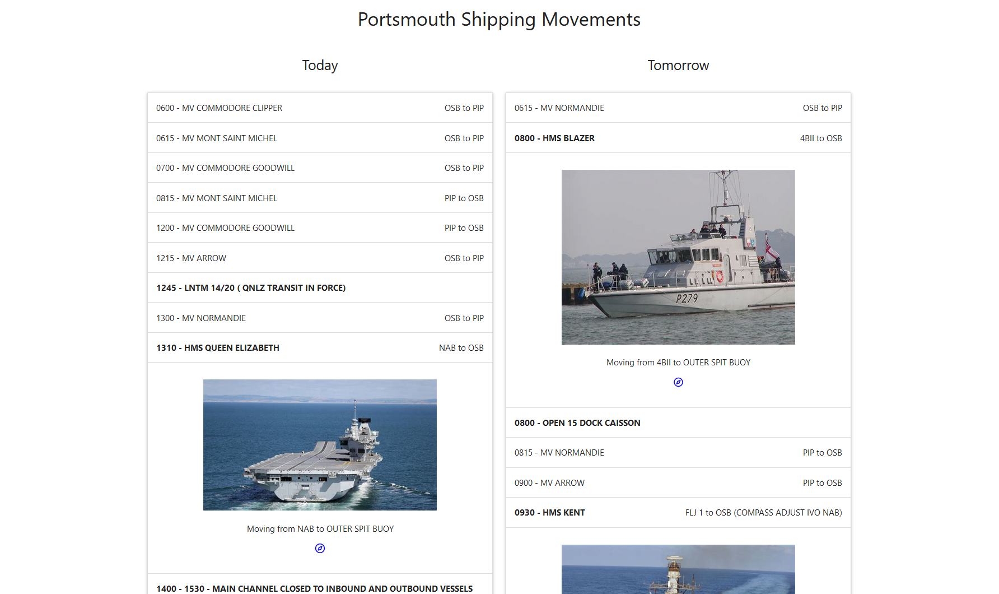

# Portsmouth Shipping Movements

https://psm.simonj.tech/

A website to show Portsmouth Harbours shipping movements.

The data gets scraped every 6 hours from the links on the ["QHM Portsmouth" page](https://www.royalnavy.mod.uk/qhm/portsmouth/shipping-movements).

